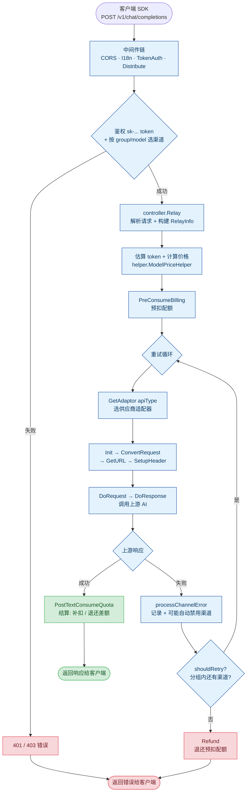

<!-- refreshed: 2026-07-01 -->
# 核心流程图

**分析日期：** 2026-07-01

本文档用 Mermaid 流程图展示 new-api 的核心代码逻辑：一个客户端请求从进入到响应的完整路径。基于 `ARCHITECTURE.md` 中的"主请求路径（Relay —— 例如 `POST /v1/chat/completions`）"。

## 核心 Relay 请求流程

## 三句话理解

1. **入口**：客户端用 OpenAI/Claude/Gemini 兼容格式发请求 → Gin 路由层接住 → 经过 `TokenAuth` 鉴权和 `Distribute` 渠道分发
2. **核心**：`controller.Relay` 编排"解析 → 计价 → 预扣配额 → 重试循环 → 结算"五步，重试循环用 `Adaptor` 接口适配 40+ 上游供应商
3. **闭环**：成功就结算差额（补扣或退还），失败就 `Refund` 退还预扣；渠道连续失败会自动禁用

## 关键设计点

| 设计 | 作用 | 代码位置 |
|------|------|----------|
| **Adaptor 接口** | 用一套统一方法把单个上游供应商抽象掉，新增供应商 = 加 case + 子包 | `relay/channel/adapter.go`、`relay/relay_adaptor.go:54` |
| **RelayInfo** | 在流水线中传递的上下文对象，承载 token/user/channel/billing 状态 | `relay/common/relay_info.go` |
| **BillingSession** | 预扣 → 结算/退还的会话封装，钱包和订阅计费共享同一套代码 | `service/billing_session.go`、`service/billing.go` |
| **重试循环** | 同一分组内多渠道降级，`shouldRetry` 控制是否继续 | `controller/relay.go:191-237` |
| **渠道缓存** | (group, model) → 已启用渠道 ID 有序列表，加权优先级选择 | `model/channel_cache.go`、`model/ability.go` |

## 关联文档

- [ARCHITECTURE.md](./ARCHITECTURE.md) — 完整架构、分层、数据流、关键抽象
- [STRUCTURE.md](./STRUCTURE.md) — 目录布局与关键位置
- [CONCERNS.md](./CONCERNS.md) — 技术债、bug、安全、性能问题

---

*流程图分析：2026-07-01*
